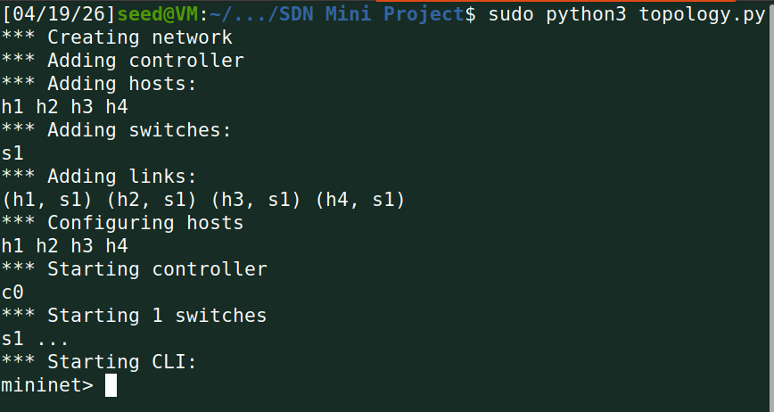
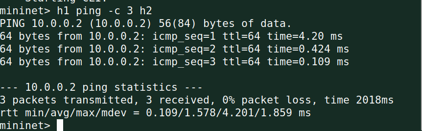
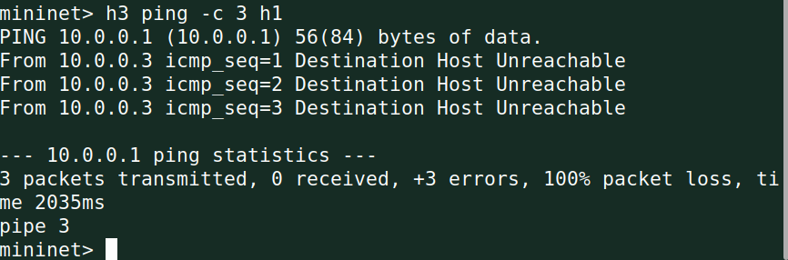
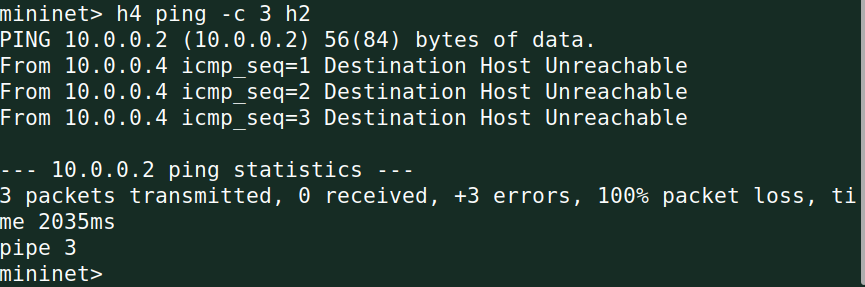
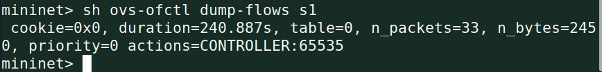
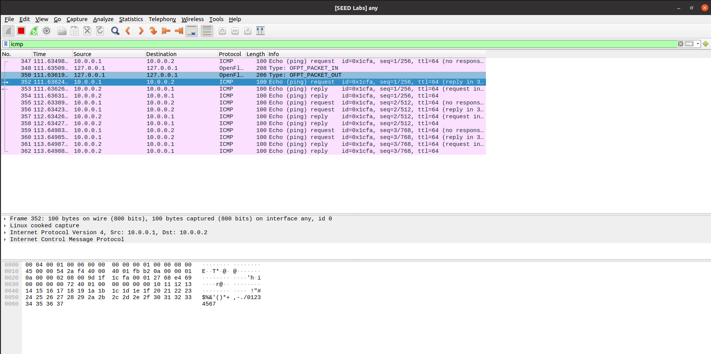
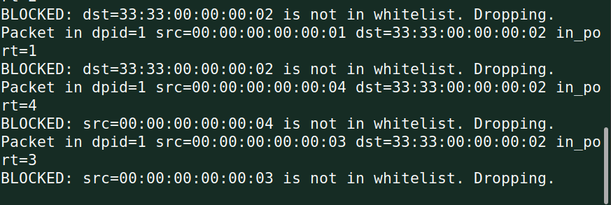
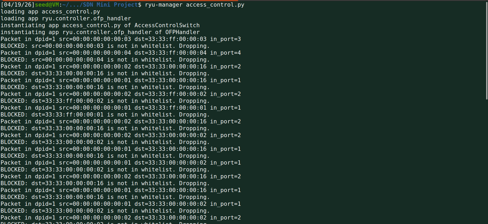

# SDN-Based Access Control System

**Name:** Aanya K
**SRN:** PES2UG24CS011
**Course:** Computer Networks - UE24CS252B

## Problem Statement
This project implements an SDN-based firewall using Mininet and Ryu OpenFlow controller. The system maintains a whitelist of authorized MAC addresses and installs explicit allow/deny OpenFlow flow rules to permit only whitelisted hosts to communicate, while blocking all unauthorized hosts. This demonstrates controller-switch interaction, flow rule design, and network behavior observation.

## Objective
* Maintain a whitelist of authorized MAC addresses
* Install explicit allow/deny OpenFlow flow rules
* Block unauthorized hosts from communicating
* Verify access control through testing and regression
* Observe and measure network performance metrics

## Topology Design & Justification
* **Switch:** 1 Switch (s1) — single switch keeps the topology simple and focused on access control logic rather than routing complexity.
* **Hosts:** 4 Hosts (h1, h2, h3, h4)
* **Whitelisted (Allowed):** h1 (00:00:00:00:00:01), h2 (00:00:00:00:00:02)
* **Blocked:** h3 (00:00:00:00:00:03), h4 (00:00:00:00:00:04)
* **Controller:** Ryu (RemoteController on 127.0.0.1:6633)

MAC-based filtering was chosen because MAC addresses are fixed at the hardware level and are the most reliable identifier at Layer 2.

## SDN Logic & Flow Rule Implementation
The controller implements the following logic in `access_control.py`:

* **packet_in handler:** Every unmatched packet is sent to the controller which checks the source and destination MAC against the whitelist.
* **Match-action design:**
    * `eth_src` match: drops packets from non-whitelisted source MACs.
    * `eth_dst` match: drops packets destined for non-whitelisted MACs.
    * `in_port + eth_src + eth_dst`: installs allow rules for whitelisted pairs.
* **Flow rule priorities:**
    * **Priority 0:** Table-miss rule, sends all unmatched packets to controller.
    * **Priority 5:** Allow rule for whitelisted host pairs.
    * **Priority 10:** Deny rule for unauthorized source MACs (overrides allow).
* **Idle timeouts:** 30 seconds for deny rules, 60 seconds for allow rules.

## Setup & Installation
\`\`\`bash
sudo apt install mininet -y
pip3 install ryu
\`\`\`

## Execution Steps
1. **Terminal 1 - Start Ryu controller:**
\`\`\`bash
ryu-manager access_control.py
\`\`\`

2. **Terminal 2 - Start Mininet topology:**
\`\`\`bash
sudo python3 topology.py
\`\`\`

---

## Proof of Execution

### Topology Startup

### Scenario A - Allowed Communication (h1 ping h2)

### Scenario B - Blocked Communication (h3 ping h1)

### Regression Test (h4 ping h2)

### Flow Table

### iperf Throughput

### Wireshark - Allowed Traffic Capture

### Ryu Controller Logs - Blocked Traffic

### Ryu Controller - Full Session Log

---

## Performance Metrics & Analysis
| Metric | Value | Interpretation |
|:---|:---|:---|
| h1 to h2 latency (avg) | 1.578 ms | Low latency, efficient forwarding |
| h1 to h2 throughput | 7.71 Gbits/sec | High bandwidth between allowed hosts |
| h3 to h1 packet loss | 100% | Blocking working perfectly |
| h4 to h2 packet loss | 100% | Policy consistent across blocked hosts |
| Flow table packets | 33 packets / 2450 bytes | Controller actively managing flows |
| Deny rule timeout | 30 seconds | Flow table stays clean |
| Allow rule timeout | 60 seconds | Stable sessions for whitelisted hosts |

## Validation Summary
| Test | Expected | Result | Status |
|:---|:---|:---|:---|
| h1 ping h2 | 0% loss | 0% loss | **PASSED** |
| h3 ping h1 | 100% loss | 100% loss | **PASSED** |
| h4 ping h2 | 100% loss | 100% loss | **PASSED** |
| iperf h1 h2 | High throughput | 7.71 Gbits/sec | **PASSED** |
| Flow table check | Rules installed | priority=0 active | **PASSED** |
| Ryu logs | BLOCKED warnings | Visible for h3, h4 | **PASSED** |
